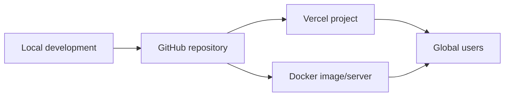

# Architecture

## Goal

Build a product-agnostic cross-border commerce backend that supports fast local development, GitHub-based source control, Vercel deployment, and migration to any Docker cloud.

## Current Modules

- Catalog: products, categories, product metadata, SKU, origin country, ship-from node
- Cart and checkout: stock validation, coupon discount, shipping rate selection, tax calculation
- Orders: order creation, payment status, fulfillment status, tracking number
- Customers: basic buyer records for admin views
- Inventory: stock, reserved quantity, available quantity
- Admin: token-protected metrics, product, order, customer, inventory, settings, fulfillment APIs

## Deployment Model

## Storage Plan

The current storage is in-memory for speed. The next durable implementation should introduce:

- `products`
- `product_variants`
- `inventory_locations`
- `customers`
- `orders`
- `order_items`
- `payments`
- `fulfillments`
- `coupons`
- `audit_events`

Keep route handlers thin and move persistence behind repository functions so Vercel and Docker deployments share the same application code.
